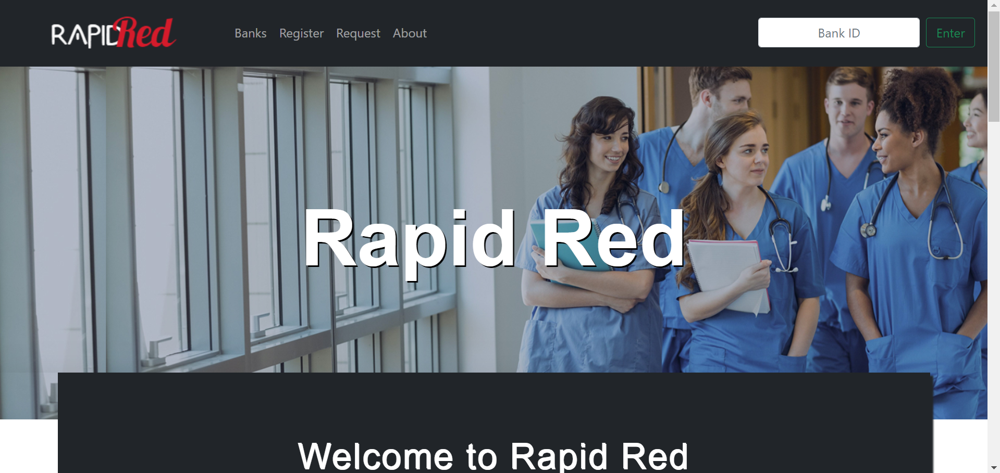
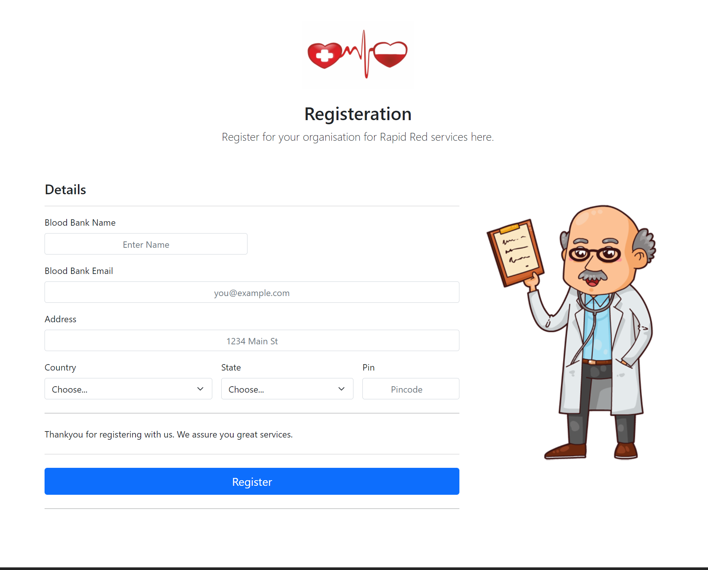
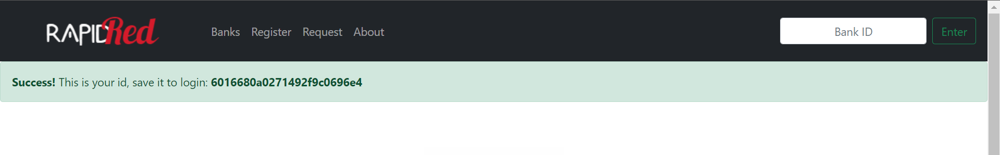
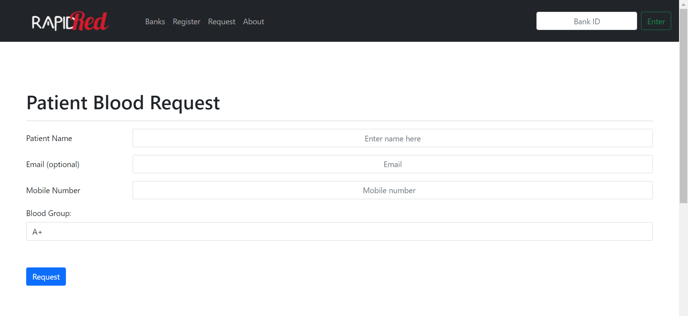
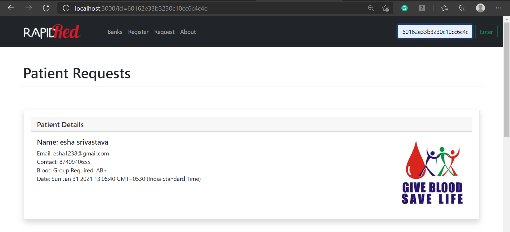
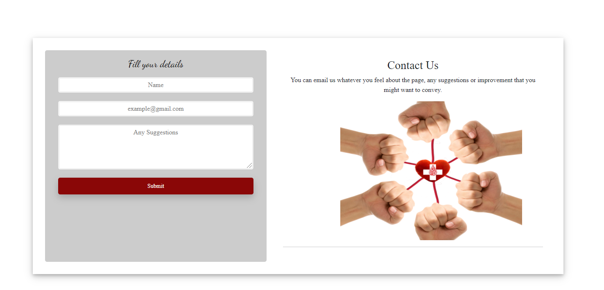

# T35-Imposter
Official Repository for DotSlash 4.0 Submission of Team 35: Imposter

# Rapid Red 
This is our official project for Dotslash 4.0<br>

# Introduction:drop_of_blood::hospital:
This Web-App is Based on the Theme 'Rural Health Development'.<br><br>

<br><br>People in the Rural Areas do not have much access to Internet facility and might also not have an E-mail ID.So, considering all these factors our Web-App provides the best for them.<br>
We have created a Simple Application which reduces complexity as much as possible so that people can make blood request when Urgent without any tedious operations.<br>
Considering People in Rural areas will not keep a track of verification from the Blood Bank once requested the Blood Bank will take people's Data from our Web-App and Contact them. It is just a platform to convey the message to the blood banks about the details of patient requiring blood.
Every Registerd Blood Bank will be provided with a Unique ID which they will use to Access all the Requests. This is done so that no leyman can access any patient's information. <br><br>

# How it works :thinking:?
## Registration Page For Blood Banks :pencil:
This is the registration form for Blood Banks providing their relevant information.<br><br>

<br><br>After registering on the site, a unique ID is generated for every Blood Bank which is confidential and can be used to view the requests in the _Search Bar_ provided on the __HOME__ page.<br><br>
<br>
After successfully registering on the page the information of the Blood Bank is automatically added on the Web page associted with the 'bank' link which can be viewed by anybody who visits thw webpage. This page gives a list of all banks registered to our website.<br><br>
<br>

## Registration Page for Blood Request :pencil:
This is a request form page for the patients who need blood of a particular group. We have kept thr form simple keeping in mind that the people in rural areas are not very techno savy.<br><br>

<br><br>Blood Banks can view the requests of blood raised the the individuals by entering their unique id that was provided to them during registration in the input field in the nav bar. If the id is wrong or not present they wont we able to see the blood requests. Also a random person cannot get access to the request and hence the patient info like their number as for every bank id, a unique url is created using Express js.<br><br> Each patient request for blood is automatically removed from the database after two days, to keep it clean and updated. <br><br>
<br>

## Contact Us :e-mail:
Suggestions are welcomed and people can send it thorugh the _Contact Us_ form provided.<br><br>
<br>

# Code Snippets
## Module Used:
```
const express = require("express");
const bodyParser = require("body-parser");
const ejs = require("ejs");
const mongoose = require("mongoose");
```

## Tech Stack
* node.js 
* express.js
* javascript
* Css
* HTML
* Mongo db

# Contributors:<br>
* Sakshi Jain<br>
* Himani Verma<br>
* Riya Sharma


